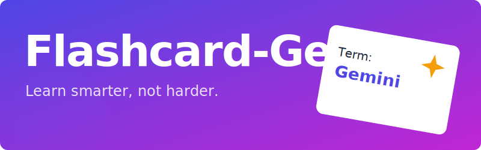

# Flashcard Generator with Gemini AI - PRD



## 1. Overview

The Flashcard Generator is a dynamic, AI-powered web application designed to help users create, study, and manage flashcards on any topic. By leveraging the Google Gemini API, it transforms a simple user-provided topic into a rich, interactive, and intelligent learning experience.

This document serves as both the project's README and its Product Requirements Document (PRD), outlining its features, technical specifications, and user flows.

**Target Audience:** Students, educators, lifelong learners, and anyone looking for a quick and powerful way to create digital study aids.

## 2. Core Features

### 2.1. AI-Powered Flashcard Generation
-   **Topic-Based Generation:** Users can enter any topic (e.g., "Ancient Rome", "Quantum Physics", "Common Italian Phrases") into a text area.
-   **Intelligent Content Creation:** The Gemini API (`gemini-2.5-flash`) is prompted to generate a structured set of flashcards, including:
    -   A clear **term**.
    -   A comprehensive **definition** (2-3 sentences).
    -   **Markdown formatting** (`<strong>`, lists) for enhanced readability.
-   **Automatic Content Analysis:** The AI performs several layers of analysis on the generated content:
    -   **Language Detection:** For each term, the AI determines if it is non-English and provides its BCP-47 language code (e.g., `fr-FR`). This enables the text-to-speech feature.
    -   **Location Awareness:** The AI determines if the overall topic is primarily geographical. If so, it provides a relevant city and country.
    -   **Keyword Extraction:** The AI extracts 2-4 key entities or proper nouns from each definition to power more precise search links.

### 2.2. Interactive Flashcard UI
-   **Grid Display:** Generated flashcards are displayed in a clean, responsive grid.
-   **Zoom View:** Clicking on a flashcard opens a modal overlay, presenting a large, focused view of the card's definition for easy reading. The overlay can be dismissed by clicking the background or pressing the `Escape` key.
-   **In-Place Editing:** Users can edit the term and definition of any flashcard directly. An "edit" icon appears on hover, which transforms the card into an editing form. Changes can be saved or canceled.
-   **Text-to-Speech:** Flashcards with a detected foreign language term display a speaker icon. Clicking this icon uses the browser's native Speech Synthesis API to pronounce the term.
-   **Contextual Links:**
    -   For location-based topics, a "Search on Map" link is displayed on the card, which opens Google Maps with a pre-filled query (e.g., "Colosseum, Rome, Italy").
    -   For all other topics, a "Google Search" link is provided, which uses the term and the AI-extracted keywords for a more relevant search.

### 2.3. Data Management
-   **Import from File:** Users can import flashcard sets from local files. Supported formats are:
    -   `.json`: A structured file matching the application's data model.
    -   `.txt`: A simple `Term: Definition` format, one per line.
-   **Export to JSON:** The current set of flashcards (including any edits) can be exported to a `.json` file. The filename is automatically generated based on the topic.
-   **Session Persistence:** The entire application state (current topic, flashcards, and location data) is automatically saved to the browser's `localStorage`. This ensures the user's work is not lost when they close the tab or refresh the page.
-   **Clear Functionality:** A "Clear" button allows the user to reset the application to its initial state, clearing the topic, flashcards, and local storage.

### 2.4. Interactive Quiz Mode
-   **AI-Powered Answer Evaluation:** An interactive study mode to test your knowledge. Instead of requiring an exact match, Quiz Mode uses the `gemini-2.5-flash` model to analyze the user's typed answer for semantic correctness. This provides a more natural and forgiving quiz experience.
-   **Live Scoring & Progress:** The UI displays the current score and progress through the shuffled deck.
-   **Reveal Answer:** If an answer is marked incorrect, the user has the option to reveal the correct definition before proceeding.
-   **Quiz Summary:** At the end of the quiz, a summary screen shows the final score and percentage.

### 2.5. User Experience & Design
-   **Modern UI:** The interface is clean, intuitive, and inspired by Google's Material Design principles.
-   **Light & Dark Mode:** The application respects the user's system theme preference for a comfortable viewing experience at any time of day.
-   **Responsive Design:** The layout adapts smoothly to various screen sizes, from mobile devices to desktops.
-   **Accessibility:** The application incorporates ARIA attributes (`aria-label`, `role="button"`, etc.) and keyboard navigation to ensure it is usable by a wide range of users.
-   **Informative Feedback:** The UI provides clear loading states and error messages to keep the user informed.
-   **Version Display:** The application's version number is displayed in the footer, making it easy to track updates.

### 2.6 Architecture Advantages
-   **Minimal Backend:** The application is a static web app that runs entirely in the user's browser. It avoids the complexity of databases, server-side code, and user account management.
-   **User-Provided API Keys:** The user provides their own Gemini API key, which is stored locally. This enhances privacy and security, as the key and user data are never processed by an intermediary server.
-   **Direct API Access:** The web client handles all UI, data management, and direct calls to the Google AI services.

## 3. Technical Specifications

### 3.1. Frontend Stack
-   **Language:** JavaScript (from TypeScript source)
-   **Markup:** HTML5
-   **Styling:** CSS3 (with CSS variables for theming)
-   **Module Loading:** ES Modules via `<script type="importmap">`

### 3.2. Key Libraries & APIs
-   **Google Gemini API (`@google/genai`):** Used for all AI-powered content generation and analysis. The `gemini-2.5-flash` model is used for its balance of speed and capability.
-   **Marked.js:** Parses the Markdown in terms and definitions into HTML.
-   **DOMPurify:** Sanitizes the HTML output from Marked.js to prevent XSS vulnerabilities.
-   **Browser APIs:**
    -   `SpeechSynthesis API`: For the text-to-speech feature.
    -   `localStorage API`: For session persistence and storing the user's API key.
    -   `FileReader API`: For importing local files.

### 3.3. Data Models
The application's data models, defined in the original TypeScript source, are as follows:
```typescript
interface Flashcard {
  term: string;
  definition: string;
  languageCode?: string;      // BCP-47 code, e.g., 'fr-FR'
  searchKeywords?: string[]; // e.g., ['Florey', 'Heatley']
}

interface Location {
  city: string;
  country: string;
}

interface AppState {
  topic: string;
  flashcards: Flashcard[];
  location: Location | null;
  isLocationBased: boolean;
}
```

### 3.4. Gemini API Request Schema
The application requests a specific JSON structure from the Gemini API to ensure reliable parsing.
```json
{
  "type": "OBJECT",
  "properties": {
    "flashcards": {
      "type": "ARRAY",
      "items": {
        "type": "OBJECT",
        "properties": {
          "term": { "type": "STRING" },
          "definition": { "type": "STRING" },
          "languageCode": { "type": "STRING" },
          "searchKeywords": {
            "type": "ARRAY",
            "items": { "type": "STRING" }
          }
        }
      }
    },
    "location": {
      "type": "OBJECT",
      "properties": {
        "city": { "type": "STRING" },
        "country": { "type": "STRING" }
      }
    },
    "isLocationBased": { "type": "BOOLEAN" }
  }
}
```

## 4. Gemini API Key
This application runs entirely in your browser. To use the AI features, you must provide your own Google Gemini API key.

1.  **Get a Key:** Obtain a free API key from [Google AI Studio](https://aistudio.google.com/app/apikey).
2.  **Enter Your Key:** When you first open the app, a modal will appear asking for your key. You can also open this modal at any time by clicking the "Settings" button.
3.  **Local Storage:** Your API key is saved only in your browser's local storage. It is never sent to any server other than the Google AI services you are directly calling.

## 5. Setup and Running

1.  **Open the App:** Open the `index.html` file in a modern web browser.
2.  **Provide API Key:** Follow the on-screen instructions to enter your Gemini API key.
3.  **Usage:** Enter a topic in the text area and click "Generate Flashcards".

## 6. Deployment to GitHub Pages

This application is a static site and can be easily deployed for free using GitHub Pages.

1.  **Create a GitHub Repository:** If you haven't already, create a new repository on GitHub and push the project files (`index.html`, `index.css`, `index.js`, etc.) to it.

2.  **Navigate to Settings:** In your repository's main page on GitHub, click on the **Settings** tab.

3.  **Go to Pages:** In the left sidebar, click on **Pages**.

4.  **Configure the Source:**
    *   Under "Build and deployment", for the "Source" option, select **Deploy from a branch**.
    *   Under "Branch", select your main branch (usually `main` or `master`).
    *   For the folder, select **`/ (root)`**.
    *   Click **Save**.

5.  **Wait for Deployment:** GitHub will start a process to deploy your site. This may take a few minutes. You can monitor the progress in the "Actions" tab of your repository.

6.  **Access Your Site:** Once the deployment is complete, the URL for your live site will be displayed at the top of the Pages settings. It will typically be in the format: `https://<your-username>.github.io/<your-repository-name>/`.
-  Example: <https://code24x7-r.github.io/Flashcard-Gen/>

## 7. Future Enhancements
-   **Image Generation:** Add an option to generate relevant images for flashcards using a model like Imagen.
-   **Spaced Repetition System (SRS):** Implement an algorithm to schedule card reviews for optimal learning.
-   **Sharing:** Allow users to share their flashcard sets with others via a unique URL.
-   **Export to PDF/Print:** Provide an option to export flashcards to a print-friendly format.